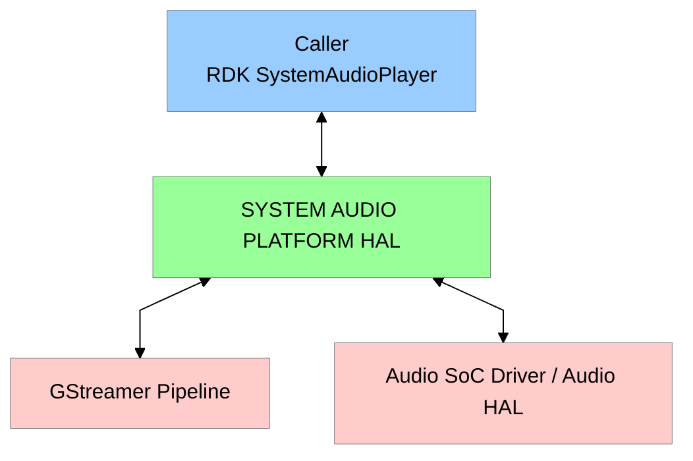
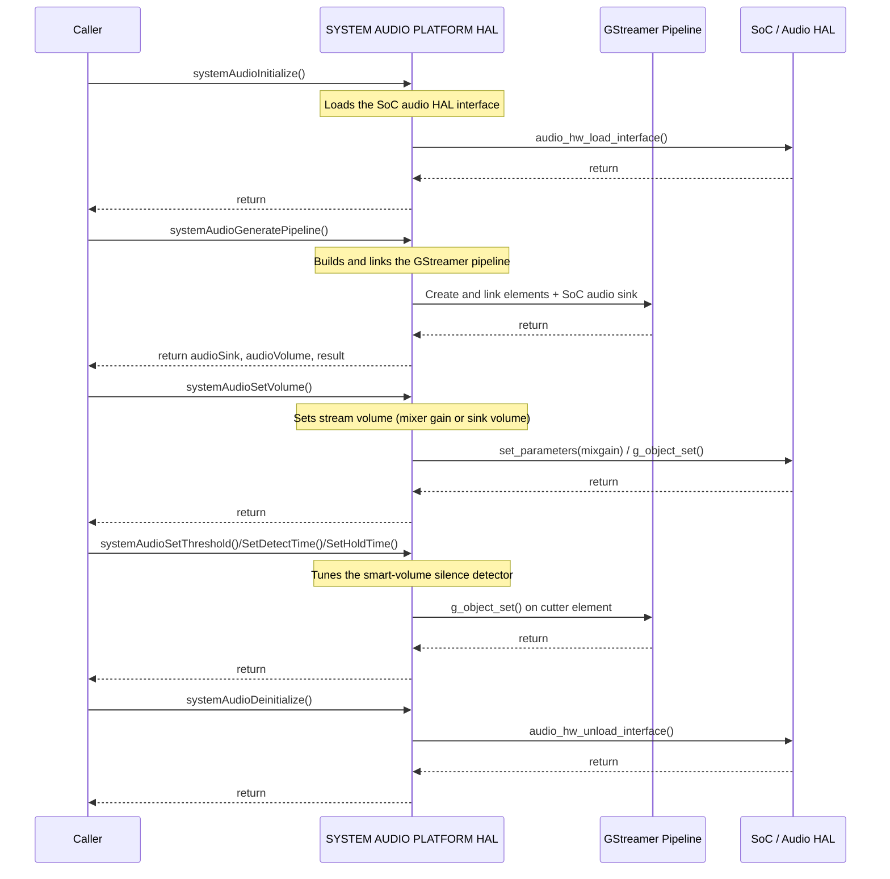

# SYSTEM AUDIO PLATFORM HAL Documentation

## Table of Contents

- [SYSTEM AUDIO PLATFORM HAL Documentation](#system-audio-platform-hal-documentation)
  - [Table of Contents](#table-of-contents)
  - [Acronyms, Terms and Abbreviations](#acronyms-terms-and-abbreviations)
  - [Description](#description)
  - [Component Runtime Execution Requirements](#component-runtime-execution-requirements)
    - [Initialization and Startup](#initialization-and-startup)
    - [Threading Model](#threading-model)
    - [Process Model](#process-model)
    - [Memory Model](#memory-model)
    - [Power Management Requirements](#power-management-requirements)
    - [Asynchronous Notification Model](#asynchronous-notification-model)
    - [Blocking calls](#blocking-calls)
    - [Internal Error Handling](#internal-error-handling)
    - [Persistence Model](#persistence-model)
  - [Non-functional requirements](#non-functional-requirements)
    - [Logging and debugging requirements](#logging-and-debugging-requirements)
    - [Memory and performance requirements](#memory-and-performance-requirements)
    - [Quality Control](#quality-control)
    - [Licensing](#licensing)
    - [Build Requirements](#build-requirements)
    - [Variability Management](#variability-management)
    - [Platform or Product Customization](#platform-or-product-customization)
  - [Interface API Documentation](#interface-api-documentation)
    - [Data Types](#data-types)
    - [Functions](#functions)
    - [Theory of operation and key concepts](#theory-of-operation-and-key-concepts)
    - [Diagrams](#diagrams)
      - [Operational Call Sequence](#operational-call-sequence)
  - [References](#references)

## Acronyms, Terms and Abbreviations

- `SAP`     - System Audio Platform
- `HAL`     - Hardware Abstraction Layer
- `API`     - Application Programming Interface
- `Caller`  - Any user of the interface via the `APIs`
- `SoC`     - System-on-Chip
- `RDK`     - Reference Design Kit
- `TTS`     - Text-To-Speech
- `PCM`     - Pulse Code Modulation
- `MP3`     - MPEG-1 Audio Layer III
- `WAV`     - Waveform Audio File Format
- `HTTP`    - Hypertext Transfer Protocol
- `dB`      - Decibel
- `ms`      - milliseconds
- `CPU`     - Central Processing Unit

## Description

The diagram below describes a high-level software architecture of the `SAP` module.

This interface provides a set of `SoC` specific `APIs` that allow the `RDK` `SystemAudioPlayer` service to render system, notification and `TTS` sounds and mix them over primary media that is already playing.

The interface abstracts two responsibilities from the `caller`:

- Construction of a `GStreamer` playback pipeline for the requested audio encoding (`PCM`, `MP3`, `WAV`) and source (in-memory data, `HTTP`, file or websocket), terminating in the `SoC` specific audio sink.
- Control of the underlying audio `HAL` mixer gain, so that system/`TTS` audio can be blended with the primary audio at the requested volume.

It additionally provides a "smart volume" capability, built on a `GStreamer` silence-detection element, which allows the `caller` to tune a silence threshold, detection time and hold time.

## Component Runtime Execution Requirements

The component must adeptly manage resources to prevent issues like memory leaks and excessive utilization. It must also meet performance goals for response time, throughput, and resource use as per the platform's capabilities.

Failure to meet these requirements will likely result in undefined and unexpected behaviour.

### Initialization and Startup

`Caller` must initialize by calling `systemAudioInitialize()` before calling any other `API` that controls hardware mixer gain. The `Caller` is expected to have complete control over the life cycle of the `SAP` module. `systemAudioInitialize()` is idempotent and behaves as a no-op if the interface is already initialized.

### Threading Model

This interface is not required to be thread safe. Any `caller` invoking the `APIs` must ensure calls are made in a thread safe manner. The interface relies on `GStreamer`, which may create internal threads for pipeline operation; any such threads must be handled gracefully without excessively consuming system resources.

### Process Model

This interface is required to support a single instantiation with a single process.

### Memory Model

This interface manages the `GStreamer` elements it creates. Elements added to the pipeline bin (e.g. the audio sink and, when enabled, the silence-detection element) become owned by the pipeline and must not be unreferenced independently by the `caller`. The `caller` retains ownership of the `pipeline` object it passes in. Any pointers created by the interface must be cleaned up upon termination.

### Power Management Requirements

Although this interface is not required to be involved in any of the power management operations, the state transitions must not affect its operation. e.g. on resumption from a low power state, the interface must operate as if no transition has occurred.

### Asynchronous Notification Model

This interface does not provide any asynchronous notifications or callbacks. All operations are synchronous.

### Blocking calls

This interface is not required to have any blocking calls. Synchronous calls must complete within a reasonable time period.

### Internal Error Handling

The pipeline construction `API` (`systemAudioGeneratePipeline()`) reports success or failure synchronously as a boolean return value. The remaining `APIs` return `void`; the `HAL` is responsible for handling system errors internally and logging failures.

### Persistence Model

There is no requirement for the interface to persist any setting information. `Caller` is responsible to persist any settings related to this interface.

## Non-functional requirements

The following non-functional requirements will be supported by the module.

### Logging and debugging requirements

This interface is required to support DEBUG, INFO and ERROR messages via the `SAP` logger (`SAPLOG_*`). INFO and DEBUG should be disabled by default and enabled when required.

### Memory and performance requirements

This interface will ensure optimal use of memory and `CPU` according to the specific capabilities of the platform.

### Quality Control

- This interface is required to perform static analysis, our preferred tool is Coverity.
- Have a zero-warning policy with regards to compiling. All warnings are required to be treated as errors.
- Copyright validation is required to be performed, e.g.: Black duck, and FossID.
- Use of memory analysis tools like Valgrind are encouraged, to identify leaks/corruptions.
- `HAL` Tests will endeavour to create worst case scenarios to assist investigations.
- Improvements by any party to the testing suite are required to be fed back.

### Licensing

The `HAL` implementation is expected to be released under the Apache License 2.0.

### Build Requirements

The source code must build into a shared library named `libsystemaudioplatform.so`. The build mechanism must be independent of Yocto. The build depends on `GStreamer` (`gstreamer-1.0`, `gstreamer-app-1.0`) and the `SoC` audio client library.

### Variability Management

- Any changes in the `APIs` must be reviewed and approved by the component architects.
- Any modification must support backward compatibility for the generic operations like image upgrade and downgrade.
- The interface contract (`systemaudioplatform.h`) is common across all `SoC` vendors. Each vendor provides its own implementation of `libsystemaudioplatform.so`.

### Platform or Product Customization

The pipeline elements and audio sink used internally are `SoC` specific and are selected within the vendor implementation of this interface. The public header (`systemaudioplatform.h`) remains common across vendors.

## Interface API Documentation

`API` documentation will be provided by Doxygen which will be generated from the header file `systemaudioplatform.h`.

The interface exposes the following data types and functions.

### Data Types

- `AudioType`  - Encoding of the audio content: `PCM`, `MP3`, `WAV`.
- `SourceType` - Origin of the audio data: `DATA`, `HTTPSRC`, `FILESRC`, `WEBSOCKET`.
- `PlayMode`   - Playback routing mode: `SYSTEM` (mixed with primary audio) or `APP` (application/`TTS`).
- `MixGain`    - Selects which hardware mixer gain is adjusted: `MIXGAIN_PRIM`, `MIXGAIN_SYS`, `MIXGAIN_TTS`.

### Functions

- `systemAudioInitialize()`       - Loads the audio `HAL` interface so that hardware mixer gain can be controlled.
- `systemAudioDeinitialize()`     - Unloads the audio `HAL` interface and releases associated resources.
- `systemAudioGeneratePipeline()` - Builds and links the `GStreamer` pipeline for the requested audio, terminating in the `SoC` audio sink.
- `systemAudioSetVolume()`        - Sets the playback volume for the current stream.
- `systemAudioChangePrimaryVol()` - Changes the hardware mixer gain for a given stream.
- `systemAudioSetThreshold()`     - Sets the smart-volume silence detection threshold.
- `systemAudioSetDetectTime()`    - Sets the smart-volume silence detection window (detect time).
- `systemAudioSetHoldTime()`      - Sets the smart-volume hold time.

### Theory of operation and key concepts

The `caller` is expected to have complete control over the life cycle of the `HAL`.

1. Initialize the `SAP` `HAL` using function: `systemAudioInitialize()` before making any hardware mixer gain calls. If the underlying audio `HAL` fails to load, the interface logs the error and mixer gain control is unavailable.

2. Build the `GStreamer` pipeline for the requested content using `systemAudioGeneratePipeline()`, providing the audio encoding (`AudioType`), the source type (`SourceType`), the play mode (`PlayMode`) and whether smart volume is enabled. The interface creates and links the decode/convert/resample elements and the `SoC` audio sink, returning the sink and the volume-control element to the `caller`.

3. Control playback volume:
   - `systemAudioSetVolume()` sets the stream volume. For `PCM` and `WAV`, the hardware mixer gain is used (based on `PlayMode`); for `MP3`, the sink stream volume property is used.
   - `systemAudioChangePrimaryVol()` adjusts the primary/system/`TTS` mixer gain directly. The linear volume (0-100) is converted to `dB` before being applied.

4. When smart volume is enabled, tune the silence detector:
   - `systemAudioSetThreshold()` - the amplitude level below which audio is considered silence.
   - `systemAudioSetDetectTime()` - how quickly the detector reacts when sound appears.
   - `systemAudioSetHoldTime()` - how long the detector holds its state before declaring silence again.

5. De-initialize the `SAP` `HAL` using the function: `systemAudioDeinitialize()`.

NOTE: The module would operate deterministically if the above call sequence is followed.

### Diagrams

#### Operational Call Sequence

## References

- `GStreamer` - Open source multimedia framework used to build the audio pipeline, (https://gstreamer.freedesktop.org/documentation/application-development/)
- GStreamer `cutter` element (silence detection) reference: https://gstreamer.freedesktop.org/documentation/cutter/
- `RDK SystemAudioPlayer` - RDK service that consumes this interface, (https://rdkcentral.github.io/rdkservices/#/api/SystemAudioPlayerPlugin)
- `SystemAudioPlatform` HAL - SystemAudioPlatform vendor specification (https://github.com/rdkcentral/rdkvhal-systemaudioplatform-raspberrypi4)
